```bash
Kelompok 3      : - 312210290 / MUHAMMAD ALBEDRI
                  - 312210293 / MUHAMMAD DIN AL AYUBI
                  - 312210321 / YUDI FERMANA
                  - 312210328 / ROSWANDA NURAINI
Judul Project   : Absensi QR Code
Kelas           : TI. 22. A3
Mata Kuliah     : Pemrograman Web 2
Dosen Pengampu  : Agung Nugroho,S.Kom.,M.Kom
```
<h2>Demo Aplikasi, Domain, dan Laporan</h2>

1. Demo terlampir pada link youtube, klik pada logo di bawah ini:
   
[]()

2. Laporan PDF, klik pada logo di bawah ini:
   
[](https://drive.google.com/file/d/1JTDfpgfCj9n9tFQg2Wab7GQ4PRRiYrLZ/view?usp=drive_link)

<h3>A. Gambaran Umum Sistem Absensi QR Code</h3>

Sistem Absensi QR Code berbasis web menggunakan CodeIgniter 4 dan MySQL adalah aplikasi yang dirancang untukuntuk menyimpan, mengatur, dan mengelola arsip secara digital. Ini memungkinkan organisasi untuk menggantikan atau melengkapi sistem arsip tradisional berbasis kertas dengan solusi berbasis teknologi informasi. Sistem ini memanfaatkan framework PHP CodeIgniter 4 sebagai dasar pengembangan aplikasi web dan basis data MySQL sebagai tempat penyimpanan data.

Dengan sistem ini, pengguna dapat melakukan berbagai tugas penting terkait pengelolaan keuangan RT, termasuk pencatatan transaksi, pelacakan pemasukan dan pengeluaran, serta pembuatan laporan keuangan.Berikut ini gambaran umum tentang sistem Absensi QR Code:

Sistem absensi umumnya merujuk pada cara atau teknologi yang digunakan untuk merekam kehadiran karyawan atau individu lainnya dalam suatu organisasi atau institusi. Tujuan utamanya adalah untuk memastikan bahwa kehadiran individu direkam dengan akurat, efisien, dan terdokumentasi dengan baik. Berikut ini adalah gambaran umum tentang sistem absensi:

1. **Metode Absensi Tradisional**: Sebelum era teknologi digital, sistem absensi sering kali dilakukan dengan metode manual seperti menggunakan buku absensi, kartu absensi, atau tanda tangan pada lembar kehadiran.

2. **Sistem Absensi Digital**: Dengan berkembangnya teknologi, banyak organisasi beralih ke sistem absensi digital yang memanfaatkan perangkat keras dan perangkat lunak khusus. Ini bisa berupa:

   - **Penggunaan ID atau Kartu Absensi**: Karyawan menggunakan kartu identifikasi atau kode akses untuk masuk dan keluar dari tempat kerja. Sistem ini membutuhkan pembaca kartu atau mesin sidik jari untuk mengidentifikasi karyawan.
   
   - **Penggunaan Sidik Jari atau Pengenalan Wajah**: Sistem ini menggunakan teknologi pengenalan biometrik seperti sidik jari atau pemindaian wajah untuk mengidentifikasi karyawan. Hal ini memastikan tingkat keamanan dan akurasi yang tinggi.
   
   - **Aplikasi atau Perangkat Lunak Absensi**: Beberapa organisasi menggunakan aplikasi seluler atau perangkat lunak desktop yang memungkinkan karyawan untuk mencatat kehadiran mereka sendiri, baik melalui pengisian formulir atau check-in/check-out digital.

3. **Sistem Absensi Berbasis Web**: Beberapa sistem absensi dapat diakses melalui web, memungkinkan karyawan untuk mencatat kehadiran mereka dari jarak jauh, seperti saat bekerja dari rumah atau berada di lokasi yang jauh dari kantor.

4. **Integrasi dengan Sistem Manajemen Sumber Daya Manusia (SDM)**: Sistem absensi sering terintegrasi dengan sistem manajemen SDM yang lebih besar. Hal ini memungkinkan data kehadiran digunakan untuk mengelola gaji, cuti, dan aspek manajemen lainnya.

5. **Pelaporan dan Analisis**: Sistem absensi modern sering dilengkapi dengan fitur pelaporan dan analisis yang memungkinkan manajemen untuk melacak dan menganalisis pola kehadiran karyawan, termasuk absensi yang tidak terjadwal atau terlambat.

6. **Kepatuhan Hukum**: Sistem absensi juga harus mematuhi peraturan dan undang-undang terkait privasi dan hak karyawan, terutama dalam hal penggunaan data biometrik atau informasi pribadi lainnya.

7. **Keamanan Data**: Karena sistem absensi mencakup data sensitif tentang karyawan, penting untuk memiliki langkah-langkah keamanan yang kuat untuk melindungi informasi tersebut dari akses yang tidak sah atau penyalahgunaan.

Itulah gambaran umum tentang sistem absensi modern. Setiap organisasi mungkin memiliki kebutuhan yang berbeda, sehingga sistem yang digunakan dapat bervariasi sesuai dengan skala, keamanan, dan kebutuhan manajemen kehadiran karyawan.

<h3>B. Kebutuhan Sistem</h3>

    a. Functional (Use Case)

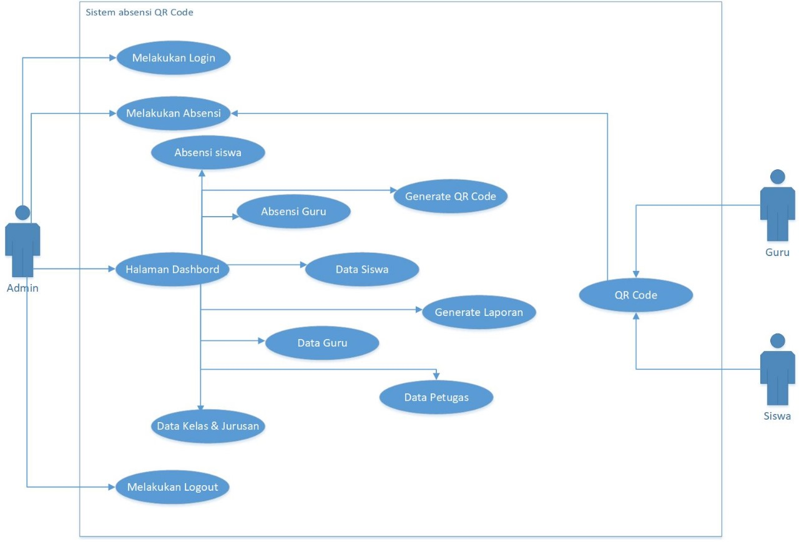

    b. Non-Functional
    Kebutuhan non-fungsional dalam aplikasi web sistem absensi sekolah berbasis QR
    Code meliputi beberapa aspek yang tidak langsung terkait dengan fungsi utama aplikasi, tetapi sangat penting dalam pengembangan dan implementasinya. Berikut adalah beberapa contoh kebutuhan non-fungsional yang relevan:
1. Keamanan: Aplikasi harus memastikan keamanan data siswa dan guru dengan menggunakan protokol enkripsi yang kuat untuk melindungi informasi sensitif. Perlindungan terhadap serangan siber, seperti serangan brute force dan SQL injection, harus diimplementasikan.
2. Ketersediaan: Aplikasi harus tersedia 24/7 sehingga pengguna dapat mengaksesnya kapan saja. Hal ini dapat dicapai dengan menggunakan infrastruktur hosting yang handal dan memiliki keandalan tinggi, serta melakukan pemeliharaan rutin untuk mencegah downtime.
3. Kinerja: Aplikasi harus responsif dan dapat menangani beban pengguna yang besar, terutama pada saat jam sibuk seperti saat siswa tiba di sekolah. Optimisasi kinerja, seperti caching data dan penggunaan teknologi web yang efisien, harus diterapkan untuk memastikan waktu respons aplikasi tetap cepat.
4. Skalabilitas: Aplikasi harus dapat diskalakan secara horizontal untuk mengakomodasi pertumbuhan jumlah siswa dan pengguna. Ini berarti sistem harus mampu menangani peningkatan lalu lintas tanpa mengurangi kinerja atau ketersediaan.
5. Interoperabilitas: Aplikasi harus dapat berintegrasi dengan sistem lain yang digunakan di sekolah, seperti sistem informasi siswa dan sistem manajemen kelas. Ini memungkinkan pertukaran data yang lancar antara aplikasi absensi dan sistem lainnya.
6. Kepatuhan Regulasi: Aplikasi harus mematuhi regulasi dan kebijakan privasi data yang berlaku, seperti GDPR (General Data Protection Regulation) di Uni Eropa atau COPPA (Children's Online Privacy Protection Act) di Amerika Serikat. Perlindungan data pribadi siswa harus menjadi prioritas utama.
7. User Experience (UX): Antarmuka pengguna haruslah ramah pengguna dan mudah digunakan, baik oleh siswa, guru, staf sekolah, maupun orang tua siswa. Desain responsif juga diperlukan agar aplikasi dapat diakses dari berbagai perangkat, mulai dari desktop hingga ponsel pintar.
8. Dukungan Bahasa: Aplikasi harus mendukung berbagai bahasa untuk memfasilitasi pengguna yang berasal dari berbagai latar belakang dan wilayah.
9. Dukungan Teknis: Tim dukungan teknis harus tersedia untuk memberikan bantuan kepada pengguna dalam menangani masalah teknis dan pertanyaan terkait penggunaan aplikasi.
10. Backup dan Pemulihan Data: Sistem harus memiliki prosedur backup dan pemulihan data yang teratur untuk melindungi data dari kehilangan atau kerusakan yang tidak terduga.
    
<h3>C. Rancangan Sistem</h3>

| 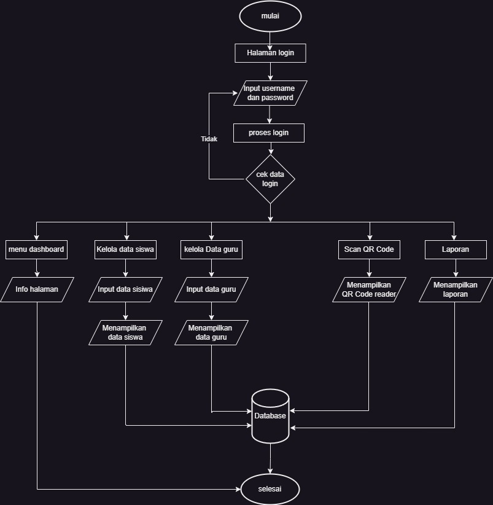 |
<h3>D. Rancangan Basis Data (Data Model/ERD)</h3>

| 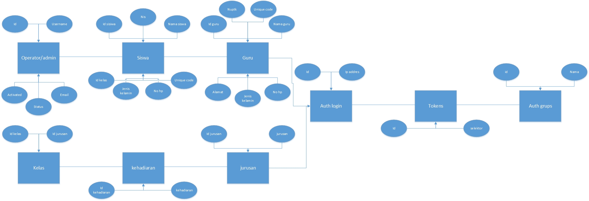 |
<h3>E. Prototype (Desain Mockup/Figma)</h3>

| Halaman Dashboard                                                                                                   |                                                           Tampilan Absen Masuk                                                           |
| --------------------------------------------------------------------------------------------------------------------------- | :----------------------------------------------------------------------------------------------------------------------: |
| 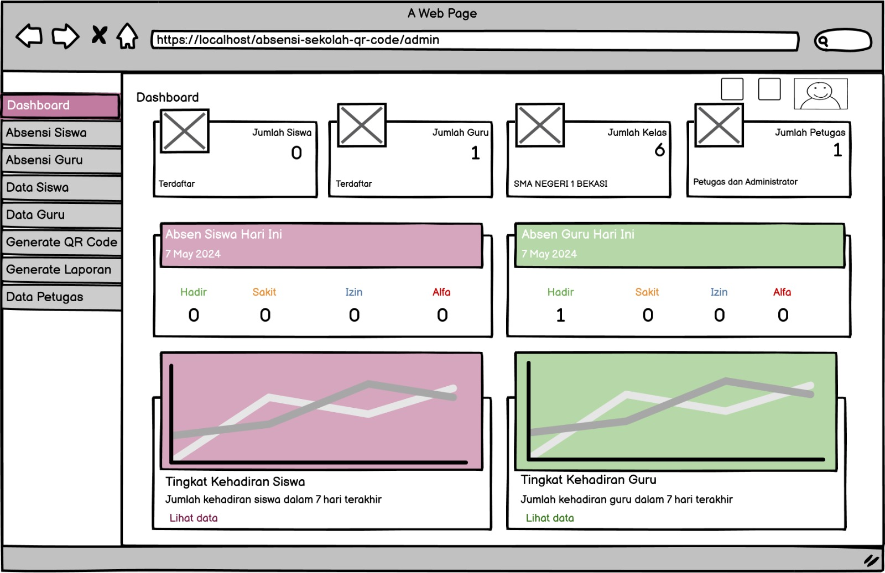 | 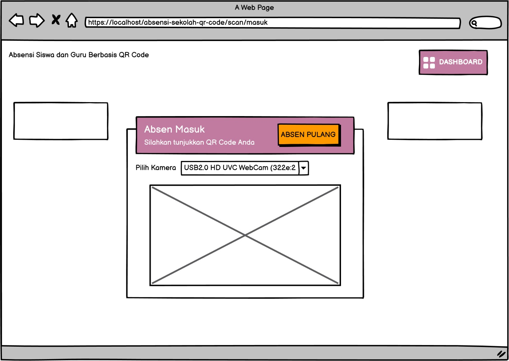 |

| Tampilan Absen Keluar                                                                                                   |                                                           Tampilan Login Petugas                                                           |
| --------------------------------------------------------------------------------------------------------------------------- | :----------------------------------------------------------------------------------------------------------------------: |
| 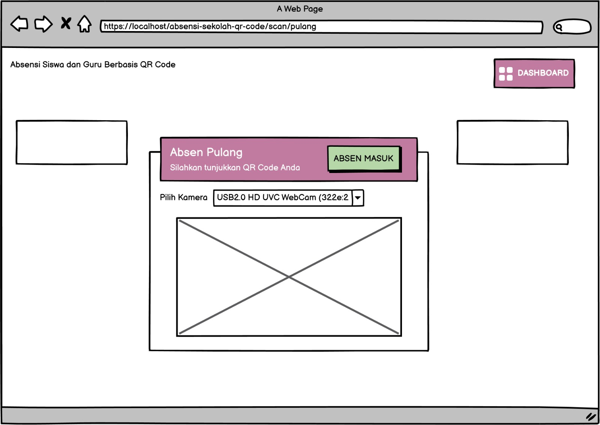 |  |

| Tampilan Dashboard Petugas                                                                                                   |                                                           Tampilan CRUD Siswa (Dengan Data Kelas)                                                           |
| --------------------------------------------------------------------------------------------------------------------------- | :----------------------------------------------------------------------------------------------------------------------: |
|  | 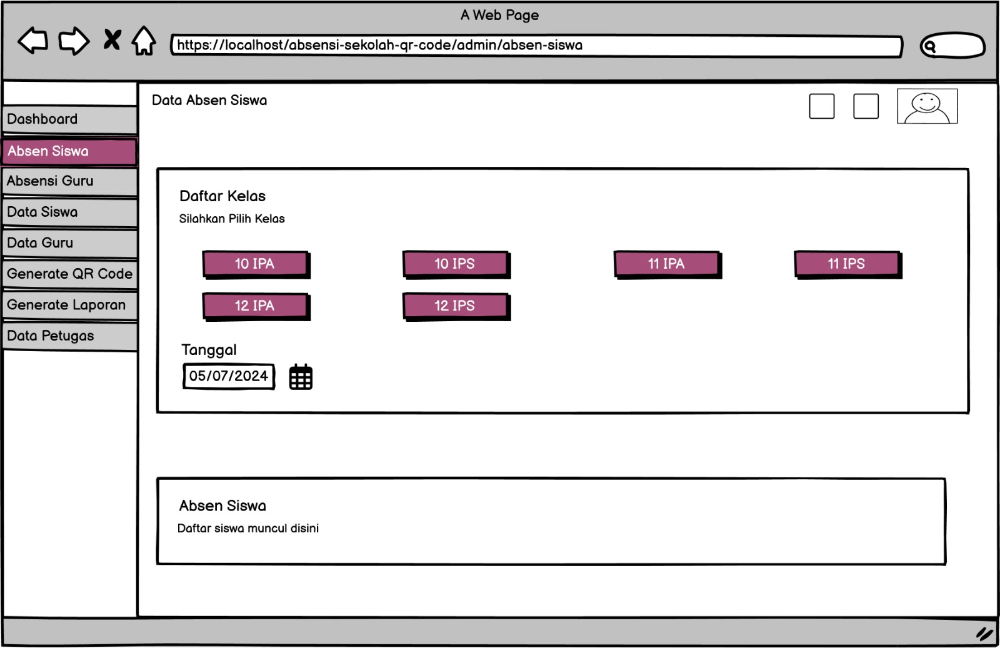 |

| Tampilan CRUD Guru (Dengan Data Kelas)                                                                                                   |                                                           Tampilan Ubah Data Kehadiran                                                           |
| --------------------------------------------------------------------------------------------------------------------------- | :----------------------------------------------------------------------------------------------------------------------: |
| 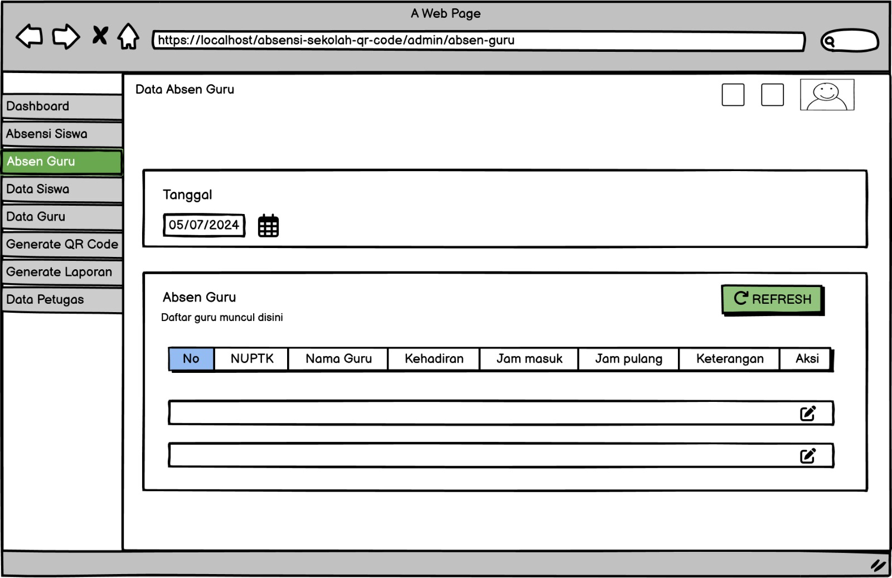 | 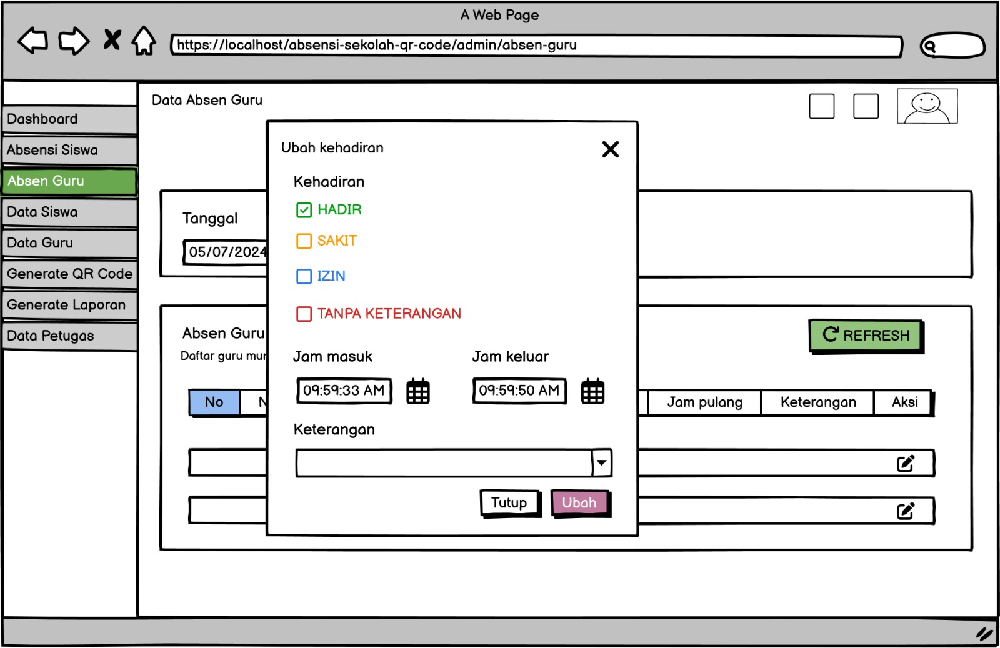 |

| Tampilan CRUD Data Siswa                                                                                                   |                                                           Tampilan CRUD Data Guru                                                           |
| --------------------------------------------------------------------------------------------------------------------------- | :----------------------------------------------------------------------------------------------------------------------: |
| 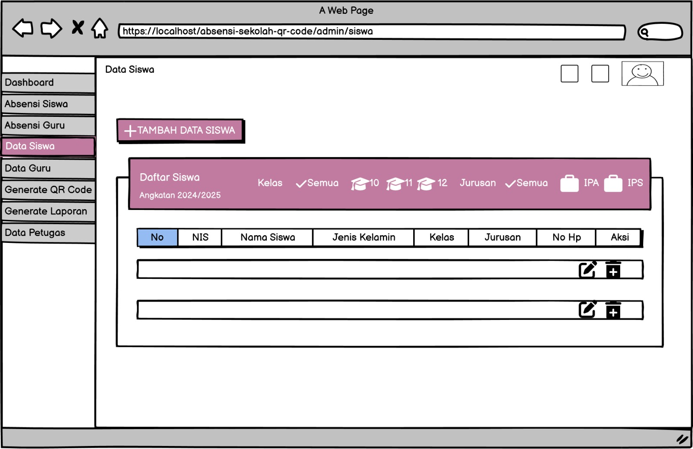 | 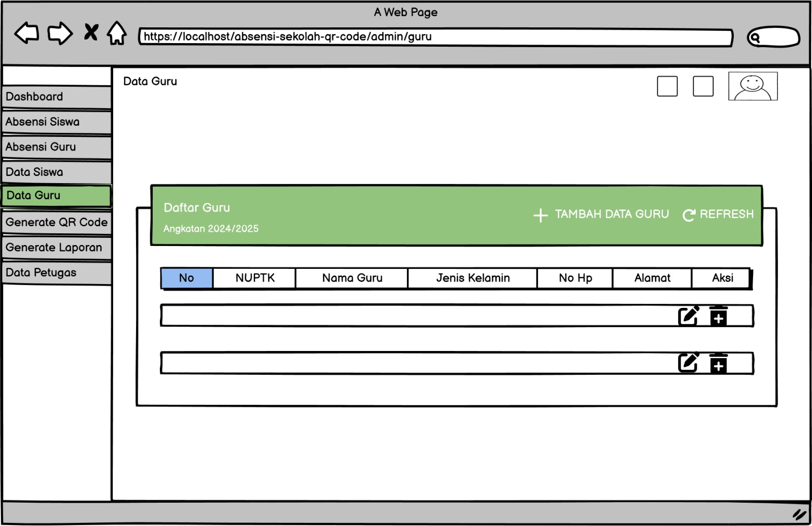 |

| Tampilan CRUD Data Kelas dan Jurusan                                                                                                   |                                                           Tampilan Generate QR Code                                                           |
| --------------------------------------------------------------------------------------------------------------------------- | :----------------------------------------------------------------------------------------------------------------------: |
| 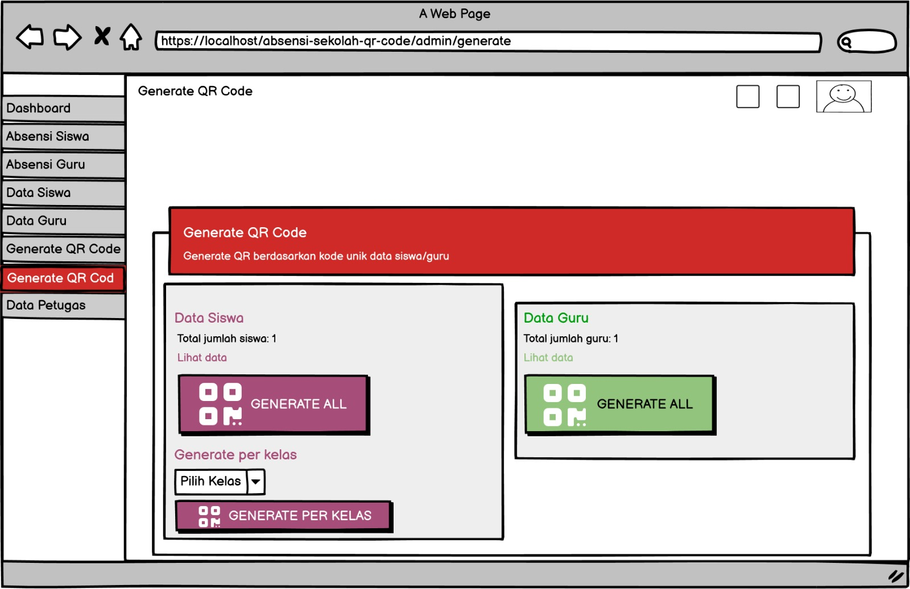 |  |

| Tampilan Generate Laporan                                                                                                   |                                                                                                                      |
| --------------------------------------------------------------------------------------------------------------------------- | :----------------------------------------------------------------------------------------------------------------------: |
| 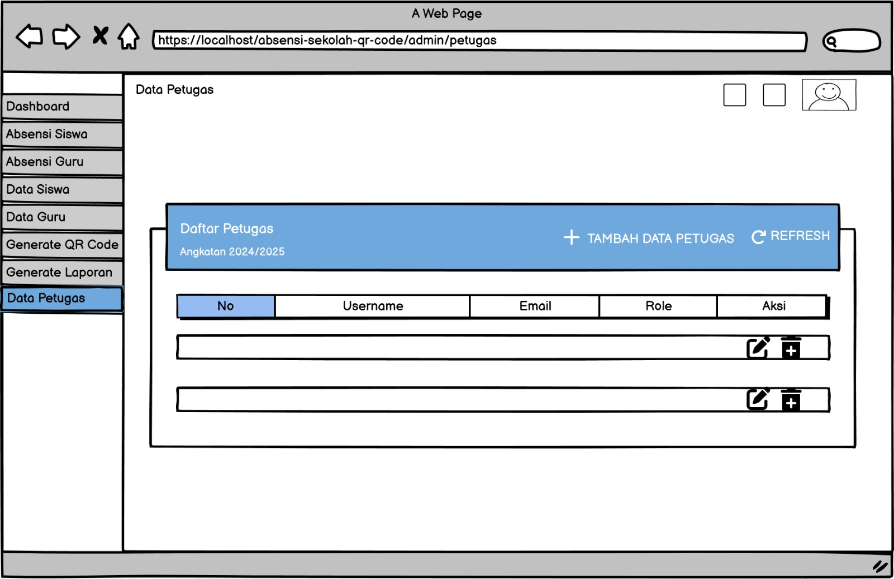 |  |

<h3>F. Hasil Akhir (Demo program)</h3>

# Aplikasi Web Sistem Absensi Sekolah Berbasis QR Code

Aplikasi Web Sistem Absensi Sekolah Berbasis QR Code adalah sebuah proyek yang bertujuan untuk mengotomatisasi proses absensi di lingkungan sekolah menggunakan teknologi QR code. Aplikasi ini dikembangkan dengan menggunakan framework CodeIgniter 4 dan didesain untuk mempermudah pengelolaan dan pencatatan kehadiran siswa dan guru.

## Fitur Utama

- **QR Code scanner.** Setiap siswa/guru menunjukkan qr code kepada perangkat yang dilengkapi dengan kamera. Aplikasi akan memvalidasi QR code dan mencatat kehadiran siswa ke dalam database.
- **Login petugas.**
- **Dashboard petugas.** Petugas sekolah dapat dengan mudah memantau kehadiran siswa dalam periode waktu tertentu melalui tampilan yang disediakan.
- **QR Code generator.** Petugas yang sudah login akan men-generate qr code setiap siswa/guru secara otomatis. Setiap siswa akan diberikan QR code unik yang terkait dengan identitas siswa. QR code ini akan digunakan saat proses absensi.
- **Ubah data absen siswa/guru.** Petugas dapat mengubah data absensi setiap siswa/guru. Misalnya mengubah data kehadiran dari `tanpa keterangan` menjadi `sakit` atau `izin`.
- **Tambah, Ubah, Hapus(CRUD) data siswa/guru.**
- **Tambah, Ubah, Hapus(CRUD) data kelas.**
- **Lihat, Tambah, Ubah, Hapus(CRUD) data petugas.** (khusus petugas yang login sebagai **`superadmin`**).
- **Generate Laporan.** Generate laporan dalam bentuk pdf.

## Framework dan Library Yang Digunakan

- CodeIgniter 4
- [Material Dashboard Bootstrap 4](https://www.creative-tim.com/product/material-dashboard-bs4)
- [Myth Auth Library](https://github.com/lonnieezell/myth-auth)
- [Endroid QR Code Generator](https://github.com/endroid/qr-code)
- [ZXing JS QR Code Scanner](https://github.com/zxing-js/library)

### Persyaratan

- [Composer](https://getcomposer.org/).
- PHP dan MySQL atau [XAMPP](https://www.apachefriends.org/download.html) versi 8.1+ dengan mengaktifkan extension `-intl` dan `-gd`.
- Pastikan perangkat memiliki kamera/webcam untuk menjalankan qr scanner. Bisa juga menggunakan kamera HP dengan bantuan software DroidCam.

### Instalasi

- Unduh dan impor kode proyek ini ke dalam direktori proyek anda (htdocs).
- Jika belum memiliki file `.env`, rename file `.env.example` menjadi `.env` atau jalankan perintah berikut:

```shell
# linux & macos, git bash
composer run-script setup-env
# windows cmd/powershell
composer run-script setup-env-win
```

- (Opsional) Konfigurasi file `.env` untuk mengatur parameter seperti koneksi database dan pengaturan lainnya sesuai dengan lingkungan pengembangan Anda.
- (Opsional) Ganti/replace logo sekolah di `public/assets/img/logo_sekolah.jpg`.
- (Opsional) Konfigurasi file `app/Config/App.php` untuk mengubah base url sesuai dengan nama folder project.
- Penting ⚠️. Install dependencies yang diperlukan dengan cara menjalankan perintah berikut di terminal:

```shell
composer install
```

- Buat database `db_absensi` di phpMyAdmin / mysql
- Penting ⚠️. Jalankan migrasi database untuk membuat struktur tabel yang diperlukan. Ketikkan perintah berikut di terminal:

```shell
php spark migrate --all
```

- Buka file `vendor/myth/auth/src/Config/Auth.php`. Lalu ubah kedua baris berikut:

```php
public $requireActivation = 'Myth\Auth\Authentication\Activators\EmailActivator';

public $activeResetter = 'Myth\Auth\Authentication\Resetters\EmailResetter';
```

- ubah value menjadi `null`:

```php
public $requireActivation = null;

public $activeResetter = null;
```

- (Opsional) Masih di file yang sama, ubah baris berikut:

```php
public $views = [
    'login'           => 'Myth\Auth\Views\login', // baris ini
    'register'        => 'Myth\Auth\Views\register',
    'forgot'          => 'Myth\Auth\Views\forgot',
    'reset'           => 'Myth\Auth\Views\reset',
    'emailForgot'     => 'Myth\Auth\Views\emails\forgot',
    'emailActivation' => 'Myth\Auth\Views\emails\activation',
];
```

menjadi:

```php
public $views = [
    'login'           => '\App\Views\admin\login', // menggunakan tampilan login custom
    'register'        => 'Myth\Auth\Views\register',
    'forgot'          => 'Myth\Auth\Views\forgot',
    'reset'           => 'Myth\Auth\Views\reset',
    'emailForgot'     => 'Myth\Auth\Views\emails\forgot',
    'emailActivation' => 'Myth\Auth\Views\emails\activation',
];
```

- Jalankan web server.
- Lalu jalankan aplikasi di browser.
- Login menggunakan krendensial superadmin:

```
username : superadmin
password : superadmin
```

Jika ingin mengubah email, username & password dari superadmin

Buka file `app\Database\Migrations\2023-08-18-000004_AddSuperadmin.php` lalu ubah & sesuaikan kode berikut:

```php
// INSERT INITIAL SUPERADMIN
$email = 'adminsuper@gmail.com';
$username = 'superadmin';
$password = 'superadmin';
```

- Izinkan akses kamera.

## Kesimpulan

Dengan aplikasi web sistem absensi sekolah berbasis QR code ini, diharapkan proses absensi di sekolah menjadi lebih efisien dan terotomatisasi. Proyek ini dapat diadaptasi dan dikembangkan lebih lanjut sesuai dengan kebutuhan dan persyaratan sekolah Anda.
